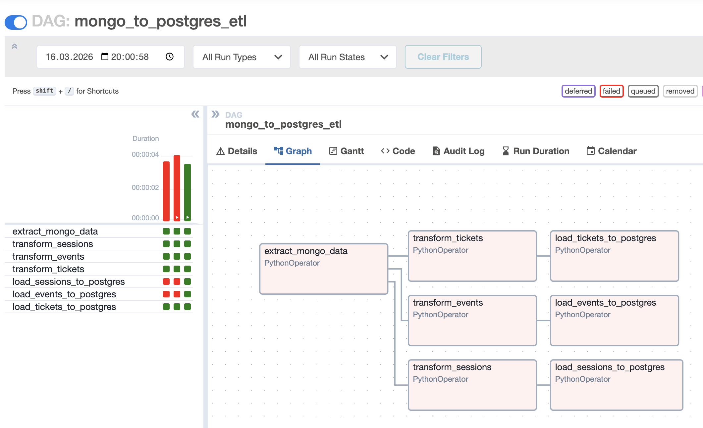
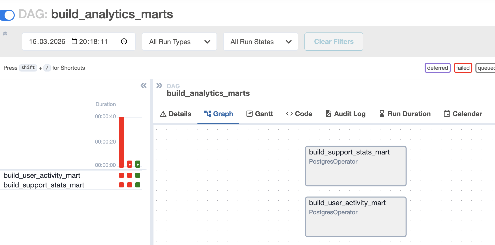
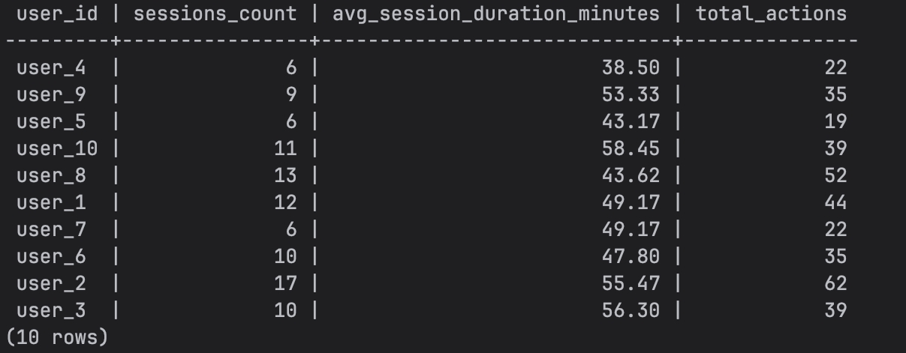
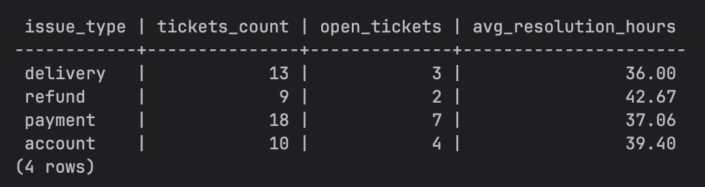

# Итоговое задание — ETL процессы

## Структура проекта

```
hse-etl-module3/
│
├── docker-compose.yml # запуск инфраструктуры (Airflow, Postgres, MongoDB)
├── Dockerfile.airflow # Airflow с дополнительными зависимостями
├── README.md 
│
├── dags/
│ ├── mongo_to_postgres.py # ETL пайплайн. MongoDB -> Postgres
│ └── marts_build.py # построение аналитических витрин
│
├── scripts/
│ └── seed_mongo.py # генерация тестовых данных в MongoDB
│
├── sql/
│ └── init_postgres.sql # создание таблиц и аналитических витрин
```

## Генерация данных

Данные генерируются в MongoDB в коллекциях:

- user_sessions
- event_logs
- support_tickets

## ETL процесс

DAG `mongo_to_postgres_etl` выполняет:

1. Extract — извлечение данных из MongoDB
2. Transform — подготовка данных
3. Load — загрузка в PostgreSQL



## Аналитические витрины



### Витрина активности пользователей

Таблица: `mart_user_activity`



Метрики:

- количество сессий пользователя
- средняя длительность сессии
- количество действий пользователя

### Витрина поддержки

Таблица: `mart_support_stats`



Метрики:

- количество обращений
- количество открытых тикетов
- среднее время решения


